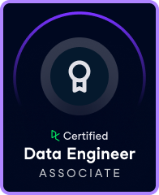

## WILS 
⌬ Woman in Tech ⚛︎ ـــــــــﮩ٨ـ   

──── ⋆⋅𖤓⋅⋆ ────

### </> Prog-Languages

---

### 🗁 Tech Stack

**Frameworks:**

 
 
 

**Libraries & Tools:**

 
 
 
 
 
 
 
 
 
 

**Databases & Management Clients:**

 

 
 

**DevOps & Infrastructure:**

 
 
 

---

### ͙͘͡★ Certifications

  
  &nbsp;&nbsp;

---

### 모 GitHub Stats

---

